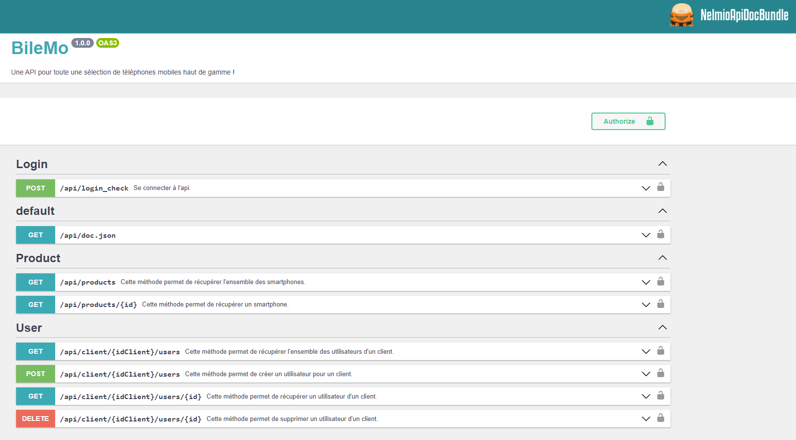

# Projet 7 - Parcours Développeur d'application - PHP / Symfony - API BileMo

[](https://www.codacy.com/gh/chris496/ChristopheDumas_7_API_BileMo/dashboard?utm_source=github.com&amp;utm_medium=referral&amp;utm_content=chris496/ChristopheDumas_7_API_BileMo&amp;utm_campaign=Badge_Grade)

<p align="center">

</p>

## Démarrage &#x1F3C1;

* "votre-serveur-local"/api/doc ou via postman (vous devez générer un token pour être autorisé à consulter les api)

## Environnement de développement &#x1F4DC;

* Symfony 6.1
* Composer 2.2.12
* WampServer 3.2.9
* Apache (version utilisé : 2.4.51)  
* Php (version utilisé : 8.1.0)
* Mysql (version utilisé : 8.0.21) ou autre bdd sql

## Installation &#x1F4BE;

* Installer Apache, Php et Mysql
* Cloner le projet git en local (se positionner dans le répertoire souhaité)

```bash
git clone https://github.com/chris496/ChristopheDumas_7_API_BileMo.git
```

* Copier-coller à la racine du projet le fichier .env et le renommer .env.local. Entrer vos infos de configuration (bdd, ...).

* Dans un terminal, positionnez vous à la racine du projet et exécuter :

```bash
composer install
```

* Créez la base de données si elle n'existe pas déjà :

```bash
php bin/console doctrine:database:create
```

* Créez les différentes tables de la base de données :

```bash
php bin/console doctrine:schema:update --force
```

* Installer les fixtures si vous souhaitez démarrer avec un jeu de données :

```bash
php bin/console doctrine:fixtures:load
```

* Générer les clés pour l'utilisation de JWT Token (attention créer un dossier "jwt" à la racine de config/)

```bash
openssl genpkey -out config/jwt/private.pem -aes256 -algorithm rsa -pkeyopt rsa_keygen_bits:4096
```

```bash
openssl pkey -in config/jwt/private.pem -out config/jwt/public.pem -pubout
```

* Préciser le mot de passe dans "JWT_PASSPHRASE=" de votre fichier .env.local

Démarrer votre serveur local :

```bash
symfony server:start
```

## Authors &#x1F60E;

* **Christophe Dumas** - [chris496](https://github.com/chris496)

